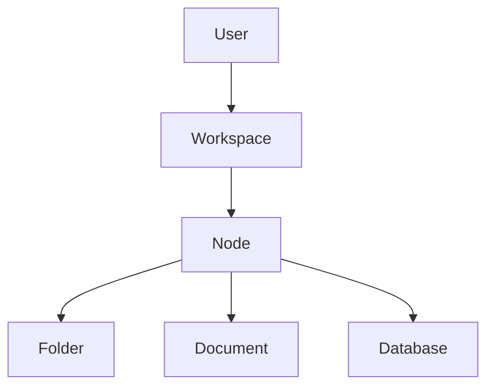

# Domain model and terminology

## 1. Top-level ownership



A user can own multiple workspaces. A workspace owns one independent node hierarchy.

## 2. Node

A Node is the shared hierarchical identity for:

- Folder
- Document
- Database

Shared behavior:

- belongs to one workspace;
- has at most one parent;
- has a title;
- may have an icon;
- has manual ordering;
- can be favorited;
- can be trashed;
- is searchable;
- appears in breadcrumbs/navigation.

Recommended shared fields are specified in `docs/04-data-model.md`.

## 3. Parent-child relation

A relation is represented by hierarchy, not by an arbitrary graph edge table.

```text
node.parent_id
```

Rules:

| Parent | Folder child | Document child | Database child |
|---|---:|---:|---:|
| Workspace root | yes | yes | yes |
| Folder | yes | yes | yes |
| Database | no | yes | no |
| Document | no | no | no |

Additional invariants:

- parent and child must belong to the same workspace;
- a node cannot parent itself;
- a move cannot create an ancestor cycle;
- a database document cannot simultaneously belong to a folder;
- changing a document's parent from a folder to a database is the act that makes it a database document.

## 4. Folder

A Folder has no separate schema in v0.1.0 beyond its Node identity.

Its purpose is unstructured organization by location.

Mental model:

> Folder = organize by where it lives.

## 5. Document

A Document is a Node plus a free-form body.

Document content is structured editor data. The user experiences Markdown typing syntax, but the editor is not a raw Markdown textarea.

Recommended canonical representation:

- Tiptap/ProseMirror JSON in PostgreSQL `jsonb`;
- a version integer for the persisted editor-content schema;
- derived `plain_text` for search/snippets.

Do not couple the persisted domain model directly to an experimental Markdown adapter.

## 6. Database

A Database is a Node plus:

- property schema;
- view configuration.

It can contain documents only.

Mental model:

> Database = organize documents by shared structure.

## 7. Database document

A database document is still a Document.

```text
Document
├── title (Node)
├── structured values from parent database
└── free-form body
```

The parent database defines which custom properties may have values.

The document title is a built-in field, not a custom database property.

## 8. Database property

Initial property types:

```text
text
number
select
multi_select
checkbox
date
url
email
files
mention
```

A property's `config` may hold type-specific metadata such as:

- select options;
- multi-select options;
- number format;
- default value.

Do not add required-property enforcement in v0.1.0.

## 9. Database value

A value belongs to:

- one database child document;
- one property defined by that document's parent database.

Invariant:

> A document may not store a value for a property owned by a different database.

Use a unique `(document_node_id, property_id)` constraint.

## 10. Mention

A mention is directional:

```text
source_document → target_node
```

Targets may be:

- document;
- folder;
- database.

A mention does not alter parentage.

Editor mention nodes should hold enough stable information to render immediately, but the target database ID must be remappable during portability restore.

Persist a mention index/table so Orbium can:

- find references;
- show "mentioned by";
- search mentions;
- support a future 2D knowledge map.

The editor body and mention index must not silently diverge. Update both in the same application transaction when saving a document.

## 11. Tag

Tags provide cross-hierarchy categorization without changing containment.

A tag:

- belongs to a workspace;
- may be attached to nodes in the same workspace;
- may use a subtle semantic/category color;
- is searchable.

## 12. Attachment

Attachments are stored as files, not database BLOBs.

Metadata belongs in PostgreSQL.

A binary file has:

- owning user/workspace;
- optional owning/referencing node;
- original filename;
- MIME type;
- byte size;
- SHA-256;
- storage key;
- purpose where useful (attachment/image/cover/avatar).

Document body references attachment IDs, so portability restore must remap embedded attachment IDs just as it remaps mention target IDs.

## 13. Trash

Deletion of normal user knowledge should be recoverable through soft deletion unless a phase explicitly implements permanent deletion.

A trashed parent and its descendants must not create visible orphan children.

Permanent deletion behavior must clean up:

- database values;
- tags pivots;
- mentions;
- attachment references/files when no longer referenced.

## 14. Future 2D graph

Not part of v0.1.0.

When introduced:

- relations can still express hierarchy;
- mentions express contextual knowledge connections;
- the 2D graph may visualize mentions across folders/workspaces according to future design.

The 3D Orbit remains hierarchy-only.
