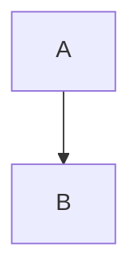

# Heading one

## Heading two

### Heading three

#### Heading four

##### Heading five

###### Heading six

A **bold**, *italic*, ~~struck~~ paragraph with `inline code`.
Soft wrapping
joins words. A hard break follows.\
Next line.

| Name | Value |
| :--- | ---: |
| Alpha | 42 |
| Beta | **Two** |

- [ ] Pending task
- [x] Completed task
- Ordinary item
  - Nested item

> [!NOTE]+ Callout title
> Body with **formatting**.

:::orbium {"kind":"block","dir":"rtl","align":"center"}
A centered paragraph.
:::

:::orbium {"kind":"block","listType":"i"}
7. Seventh item
8. Eighth item
:::

:::orbium {"kind":"empty","dir":"auto","align":"left"}
:::

:orbium[**Colored** and $x_1$]{"color":"preset:red","underline":true}

:orbium[Outer :orbium[Inner]{"color":"#75a1ff"}]{"underline":true}

See [@Architecture Notes](orbium:node/42).
Then [@Last label][target].

[target]: orbium:node/42 "Reference title"

:::orbium {"kind":"image","caption":"Caption 42 with orbium:attachment/91 as plain text","width":480,"alignment":"start"}

:::

[Report.pdf](orbium:attachment/92)

[Download diagram](orbium:attachment/91)



:::orbium {"kind":"code"}
```mermaid
Literal mermaid-language code: orbium:node/42
```
:::

Inline $E = mc^2$ and $orbium:attachment/91$.

$$
E = mc^2
orbium:node/42
$$

:::orbium {"kind":"math","latex":"a\n$$\nb"}
:::

Rare inline :orbium-math{"latex":"a\n+b"}.

::::::orbium {"kind":"table"}
:::::orbium {"kind":"row"}
::::orbium {"kind":"cell","header":true,"colwidth":[240]}
**Header one**
::::
::::orbium {"kind":"cell","header":true,"colwidth":[180]}
Header two
::::
:::::
:::::orbium {"kind":"row"}
::::orbium {"kind":"cell","align":"center"}
:::orbium {"kind":"block","dir":"ltr","align":"center"}
First paragraph.
:::

Second paragraph.
::::
::::orbium {"kind":"cell"}
- Nested list in a cell
::::
:::::
::::::

```text
[@Fake](orbium:node/42)

:::orbium {"broken":true}
:orbium[broken]
```

`orbium:node/42` and ordinary text orbium:attachment/91 create no relations.

Numbers 42 and 91 remain prose. [External](https://example.com/42/91).

\::::orbium is escaped literal text.

<script>window.example = 'inert source';</script>
