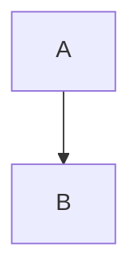

# M0 — CodeMirror and canonical Markdown migration contract

Date: 2026-10-07. Status: **architecture proposal; no engine acceptance or implementation**.

## Motivation and scope

Orbium is evaluating CodeMirror 6 with Markdown as the complete canonical body. Custom Tiptap/ProseMirror viewport virtualization is paused. Existing product capabilities are the migration contract, including features added after the original editor specification. CodeMirror is accepted only after the parity and performance gates below pass.

M0 changes documentation only. Tiptap, JSONB persistence, autosave, dependencies, and database data remain as implemented. M1 requires explicit user approval. The user has authorized the architectural direction despite the older JSON/Tiptap recommendations in `docs/01-v0.1.0-scope.md`, `docs/02-domain-model.md`, `docs/03-technical-architecture.md`, and `docs/06-document-editor.md`; those documents still describe the current runtime. This report defines the proposed replacement rather than retroactively changing that runtime specification.

## Branch strategy

Verified a clean working tree at `e6d3c258afca21d3cdd8395e4439ea32951e3b32` (`revert(editor): reject viewport rendering containment experiment`). Created `editor/codemirror-markdown` from that local HEAD and pushed it with upstream tracking. Remote master was not used as the base. All migration work stays on this branch; do not commit to or push master. M0 is one logical documentation commit: `docs(editor): define codemirror markdown migration contract`. No PR or merge is authorized.

## Audit scope and evidence

Read root `AGENTS.md`, `START_HERE.md`, `AGENTS.md` in Docs, the product/scope/domain/data/architecture/editor/search/security/portability specifications, Phase 2, phase index, and phase report guidance. Performance evidence comes from the long-document investigation and the Phase 3 rejection report, with earlier performance reports for retained-editor context.

Source inventory is rooted in `resources/js/components/editor/`, not just the original feature list:

- Composition/persistence: `document-editor.tsx`, `editor-api.ts`, `use-document-autosave.ts`, `autosave-scheduling.ts`, `markdown-import.ts`, `markdown-export.ts`, `markdown-paste.ts`.
- Blocks/marks/interaction: `media-nodes.tsx`, `image-view.tsx`, `block-formatting.ts`, `automatic-block-direction.ts`, `block-direction-inference.ts`, `text-color.ts`, `text-color-picker.tsx`, `editor-commands.ts`, `editor-suggestions.ts`, `editor-controls.tsx`, `block-context-menu.tsx`, `editor-block-gutter.tsx`, `editor-block-hover.ts`, `select-block-shortcut.ts`, `table-controls.tsx`.
- Rich rendering: `code-block-node-view.ts`, `code-languages.ts`, `code-language-icons.ts`, `incremental-code-highlighting.ts`, both math views, `use-math-preview.ts`, `use-preview-activation.ts`, `mermaid-view.tsx`, and the Mermaid session/cache/renderer/entry/layout/display/viewport/proximity/priority/scheduling helpers.
- Lifecycle/find: activity controller/hooks/bubble menu, readiness/tab shortcuts/tab activity, idle scheduling, document change ranges, performance extension, and `use-editor-search.ts`.
- Styles: the complete `styles/` subtree, especially block selectors/decorations, CSS compiler/policy, CSS CodeMirror sessions, saved-style cache/runtime, diagnostics, draft/import/export, dialog/navigation/help and sample previews.
- Integration: document page/loader/opening preview/media menu/crop code/database property header; retained document workspace, document tab context, page search, tab page cache/history handoff; editor CSS and performance instrumentation.
- Server: `DocumentController`, `AttachmentController`, `MentionCandidateController`, `SaveDocument`, `EditorContentInspector`, `DocumentInspectionResult`, `MermaidPreviewCache`, `Document`, `Attachment`, hierarchy document creation, database values/gallery/search, trash cleanup, and document/search/media/preview/style migrations. Installed StarterKit and table extension definitions were inspected to distinguish configured capabilities from UI-only affordances.

Repository searches found single-document Markdown import/export and CSS import/export, but **no implemented account archive exporter/importer or portability service** under app/resources. Portability is a documented future protocol; the existing inspector already provides JSON reference remapping. Do not claim archive round-trip acceptance based on that helper alone.

## Current JSON architecture

`documents.content` is JSONB; `content_format_version` defaults to 1, `revision` to 0, and `plain_text` is derived. `Document` casts content to an array. Title belongs to Node; cover/icon attachment IDs and cover aspect ratio are outside the body. Hierarchy creation inserts an empty document paragraph.

The controller authorizes workspace/document and visible ancestry, accepts `{content, revision}`, and checks serialized JSON against 1,048,576 bytes. The inspector allows 24 node types (including the doc root and structural nodes) and seven marks: bold, italic, underline, strike, code, link and `textColor`. It bounds nesting at 32, children per node at 5,000, and individual text at 100,000 characters. It validates heading levels 1–3, URL schemes, color tokens, direction and alignment. It does not fully enforce the ProseMirror structural schema or all custom attributes.

`SaveDocument` inspects on the server, locks the document row, compares revision, validates references, writes body/plain text/revision, removes obsolete Mermaid cache hashes, and replaces the unique source/target mention index in one transaction. Mentions must exist in the same workspace and outside Trash including ancestry. Body attachments must exist in that workspace and belong to that document. Current save validation does **not** distinguish an image node referencing a non-image attachment; the new contract must explicitly enforce it.

`DocumentInspectionResult` carries `plainText`, target-ID → label `mentions`, `attachmentIds`, and `mermaidSourcesByHash`. Plain text currently includes mention labels with @, LaTeX and Mermaid source; image/file metadata contributes no text, hard breaks contribute no explicit separator, and some nested paragraphs/cells concatenate. These are derivation gaps, not reasons to trust browser-supplied text.

Autosave retains immutable ProseMirror snapshots, serializes when saving, allows one in-flight request, retains the newest pending edit, retries failures, and uses size-aware debounce/idle scheduling. It flushes on Ctrl/Mod+S and guards navigation, unload, and tab close. Revision mismatch is a validation error, not an automatic overwrite. Retained editors preserve selection/history and pause optional work when inactive. Their reduced history payload uses a JSON placeholder; the replacement must update that shape too.

## Existing Markdown import/export audit

The helpers are convenience conversion code, **not a lossless canonical serializer/parser**.

| Area | Actual asymmetry or limitation |
| --- | --- |
| Title | Export prepends an artificial H1. Import treats it as body content; title duplication on reimport. Filename sanitization is independent of body. |
| Headings | Import clamps H4–H6 to H3. StarterKit is not configured to restrict heading levels and its defaults allow H1–H6, while server save only accepts H1–H3. Existing frontend/server inconsistency must not become silent data loss. |
| Color/underline | Color is discarded. Underline exports `<u>` but raw HTML import preserves literal text rather than reconstructing underline. |
| Direction/alignment | All block direction modes/resolved direction and paragraph/heading alignment are omitted, including nested formatting. |
| Callout | Flattened to a quote; import cannot reconstruct a callout. Current callout has no type/title/icon/fold metadata. |
| Mentions | Export generates an installation URL and @ label; import creates an ordinary link, never a relational mention. Link labels do not establish identity. |
| Images | Export uses installation attachment URL, alt or caption as a single label. Import makes text from image alt/URL, never an authorized image. Separate caption, width and alignment disappear. |
| Files | Export creates an ordinary installation link. Import does not reconstruct file identity, display-name metadata or size. Binary files are not included. |
| Math | Inline/block LaTeX exports dollar syntax but importer has no math parser: source returns as ordinary text. Bare math is not recognized by Markdown paste detection. Dollar/fence collisions are not handled by the math serializer. |
| Tables | Export treats first row as header regardless of cell kind; ignores spans/widths/cell alignment, pads ragged rows, flattens nested blocks with literal `<br>`. Import drops GFM column alignment and imports `<br>` as literal HTML text; header-column/mixed/headerless tables do not survive. |
| Lists | Nested lists/start values generally map; task recognition requires every item to be a task, so mixed task/ordinary lists lose checked metadata. Ordered-list `type` (1/a/A/i/I), accepted from rich HTML paste by the installed extension, is discarded. Tight/loose source spelling is not retained. |
| Inline code | Export always uses a single backtick pair, breaking code containing backticks and edge whitespace cases. Mark order can replace already-wrapped formatting with raw code. |
| Links | Export omits link title/target/rel/class and does not robustly encode destinations containing whitespace/parentheses. Import loses link titles. Import permits relative links via URL resolution; server only permits absolute http/https or mailto, so some imports subsequently fail save. |
| Code/Mermaid | Fence length avoids source backticks. Import normalizes language aliases/case and ignores additional info-string tokens. A code block with language `mermaid` becomes a Mermaid node; node-kind distinction is not round-trippable. |
| Whitespace/HTML | Export trims body boundaries, collapses empty paragraphs, and has no literal extension escaping. Raw HTML imports as text. Soft breaks/source escapes/entities are parser conversions, not exact source round trips. Unsupported export nodes/marks throw rather than preserve. |
| Limits/workflow | Import only into an empty document; 400,000-byte source limit and 1,000,000-byte converted JSON limit differ from controller's 1,048,576-byte limit. Markdown paste detection is heuristic, only in empty documents, and omits several rich syntaxes. |
| Other metadata | Covers, icons, database properties and account styles intentionally live outside single-document body export; Markdown export is not the self-contained archive protocol. |

## Canonical Markdown principles

Proposed dialect identifier: **orbium-markdown-v1**, stored as an explicit content-format version in API/storage/archive metadata, not as an injected title/frontmatter. Markdown source is authoritative; the AST, plain text, reference indexes, previews and syntax decorations are derived.

- UTF-8 source, LF line endings; accept CRLF at import and normalize once. Preserve source spacing and author spelling during save; do not reserialize/reformat the entire document after each keystroke.
- Body has no artificial H1. `Architecture Notes.md` uses the Node title as filename and contains actual body only. Standalone title injection can be a separate explicit export option.
- CommonMark plus GFM tables, task lists, strike and autolinks for normal content. H1–H3 remain current product affordances; preserve H4–H6 in incoming source until the heading UX decision below is made.
- Standard bold/italic/strike/code/links/lists/quotes/fences/dividers and two-space or backslash hard breaks. Blank source lines remain source, even when a normal renderer collapses empty visual paragraphs.
- Standard Mermaid fences and dollar math conventions; callouts use Obsidian syntax. Extensions appear only for semantics standard Markdown cannot carry.
- No arbitrary HTML execution, DOM parsing requirement, JavaScript, remote resource fetch during server inspection, or hostname in internal references. Render raw HTML as escaped literal source; do not strip it from stored text.
- Canonical means complete and authoritative, not one normalized spelling for every valid Markdown paragraph. UI-generated extensions use deterministic spelling; editor transactions change bounded source ranges.
- Unsupported extension versions/keys cannot be silently flattened. Preserve raw source with diagnostics while editing; a malformed reserved Orbium construct blocks persistence until corrected. Ordinary unfinished Markdown remains saveable. Import of unsupported canonical versions fails before mutation.

## Proposed extension grammar

These are M0 syntax decisions for review, not parsers already shipped. An M1 parser must implement this same grammar on PHP and TypeScript and retain source ranges; replacing it with convenience HTML output is insufficient.

### Stable mentions and attachments

```markdown
See [@Architecture Notes](orbium:node/42).


[Download notes.pdf](orbium:attachment/92)
```

IDs are positive decimal database relationship keys without leading zeroes, query, fragment, hostname, workspace path, or implicit title resolution. IDs are stable within an installation, not globally unique across installations. Archive remapping is mandatory. For server index display_text, decode the label's Markdown to text and remove one leading @ convention marker if present; IDs remain authoritative and the original label source is preserved. Any link destination exactly matching `orbium:node/<id>` is a semantic mention; @ is the UI-generated label convention, not the identity. Other `orbium:` link forms are invalid reserved references. Mention images are invalid. Reference-style Markdown links resolve through the AST before inspection; they have the same semantics as inline links.

`orbium:attachment/<id>` image syntax is an image; an ordinary link is a file/download reference. An image must reference purpose=image and an allowed image MIME (PNG/JPEG/GIF/WebP). A file link may download an image as a file, preserving current upload/download behavior. Server metadata supplies authoritative MIME/name/byte size; optional visible label is author content, never ownership evidence. For all current body references, document ownership is required, not merely workspace membership.

A normal Markdown editor displays mention/file labels as links whose custom scheme normally cannot resolve; an internal image may be broken but retains alt text. Canonical archives carry metadata and binaries. Portable ordinary Markdown export rewrites assets to deterministic relative `assets/<archive-key>.<safe-extension>` paths with copied binaries, and mentions to mapped note paths where a document exists. Folder/database mentions need companion index pages or a clearly labelled unresolved textual fallback. URL export is a separate online option resolving the current authorized route at export time. Never persist that URL in the canonical body.

### Block metadata and image metadata

```markdown
:::orbium {"kind":"block","dir":"rtl","align":"center"}
A paragraph with explicit presentation.
:::

:::orbium {"kind":"image","width":480,"alignment":"start","caption":"A separate caption"}

:::
```

A directive opener is an unescaped line, at a Markdown block boundary, containing N colons (N ≥ 3), `orbium`, one space, and a one-line JSON object. The closer is a line of exactly N colons. Container indentation/quote prefixes are removed by the Markdown container parser first. Nested directives use strictly fewer colons than their parent. UI serialization chooses the smallest valid outer fence longer than every directive-looking colon run in its body. Closing-looking text inside standard fenced code is opaque and cannot close a directive. A literal opener is escaped (`\:::orbium`) or placed inside code. Unclosed/invalid reserved directives yield diagnostics and block canonical save; they never partially apply metadata to following content.

`kind=block` wraps **exactly one logical Markdown block** (which may itself be a list/quote/table/callout/code/math/divider). It supplies `dir` in auto/ltr/rtl and optional `align` in left/center/right, with align permitted only for paragraphs/headings. Nested paragraph/heading metadata is wrapped at its actual container depth; a top-level list choice that formats all child paragraphs generates explicit child wrappers. Wrapper and inner block are one unit for move/copy/delete. No separate position-based sidecar can drift when editing.

`kind=block` also permits `listType` only when wrapping an ordered list: 1/a/A/i/I, preserving the installed extension's decimal/alphabetic/Roman display styles from rich paste. Without it the list uses decimal Markdown numbering. No type-picker UI was found; source and preview must still retain the semantic style. Generated block keys are kind, dir, align, listType.

No direction wrapper means auto. Auto direction uses the first strong Unicode character and preceding block inheritance for neutral/empty content, including caption/alt/file label/math/Mermaid text as current inference does; render/source fields for code/Mermaid/math remain LTR. Persist manual choice, not cached resolved auto direction; inheritance is derived again after moves. No align means account/default style, distinct from explicit left. Empty blocks needed as authored editor blocks use a `kind=empty` directive (no body, optional dir/align); ordinary blank separators are not serialized as empty blocks.

`kind=image` contains exactly one attachment image and carries independent caption (plain text), width (positive integer CSS px) and alignment in start/left/center/right. Width defaults to 720; alignment defaults to start; caption defaults empty. Explicit values matching defaults may be omitted by UI writers; hand-authored source remains unchanged on save. Display clamps to available width (current minimum is 120 px or the available width if narrower); source value is not silently rewritten on viewport resize. Global direction for the image is a surrounding `kind=block` wrapper. File labels use Markdown text; byte size is derived, not duplicated in source.

JSON keys are allowlisted per kind; duplicate keys, unknown keys, nulls, invalid types, non-finite/nonnumeric widths, and unpaired surrogate escapes are errors. No arbitrary style/class/event keys. Generated keys use the order shown by each schema; JSON strings use standard JSON escaping with literal Unicode and no multiline header. This is a small declarative dialect, not an executable directive system.

Fallback in a plain Markdown editor: directive lines remain visible, enclosed Markdown still reads normally; image caption metadata is visible JSON rather than a rendered caption. A portable interoperability export may flatten presentation **only as a disclosed export mode**, never as canonical persistence or archive restoration.

### Inline color and underline

```markdown
:orbium[**Colored and underlined text**]{"color":"preset:red","underline":true}

:orbium[Custom color]{"color":"#75a1ff"}
```

The unescaped literal `:orbium[` starts a balanced inline Markdown span followed immediately by a JSON object. Use Markdown backslash escapes for literal brackets and JSON string escapes in metadata. Inline parsing observes code spans, escaped delimiters and bracket nesting; no regex across serialized Markdown. Span content cannot contain a block break; nested spans are permitted within the common depth limit. Empty spans are invalid. The JSON closing boundary is determined by a JSON string-aware scanner, not the first `}`. Literal spellings use `\:orbium[` or a code span.

Only color and underline are allowed. Color is lowercase six-digit hex or one of the existing tokens `preset:charcoal`, gray, red, orange, amber, green, teal, blue, purple, pink. Retain all ten persisted names, even though the current picker shows seven. Preset purple resolves to violet in Light and yellow in Dark; do not replace it with a fixed hex. Underline is true or omitted; unset/default formatting removes that property/span. Ordinary bold/italic/strike/link/code remains Markdown within the span. Inline links retain standard optional title; target/rel/class are renderer policy, not user formatting identity.

Fallback: plain Markdown renders the inner Markdown with visible `:orbium`/JSON punctuation; color and underline are unavailable. No raw `<span style>` or `<u>` exception is needed. Live Preview may decorate/hide delimiters but must reveal source at the caret and retain selectable/editable ranges.

### Callouts, Mermaid and math

````markdown
> [!NOTE]
> Callout body with **formatting**.



$$
E = mc^2
$$

Inline $E = mc^2$.
````

Current untyped callouts map to NOTE; no current callout icon/title/collapse state needs preservation. Recognize `[!TYPE]` at the start of the first blockquote paragraph, with optional Obsidian `+`/`-` folding marker and title. TYPE is a case-insensitive ASCII identifier (`[A-Za-z][A-Za-z0-9_-]*`); generated type is uppercase. Type/title/folding are source semantics; unknown types retain source and use neutral presentation. Ordinary quotes starting with that exact sequence must escape the opening bracket to remain ordinary quotes. This matches the interoperability direction in [Obsidian callout documentation](https://obsidian.md/help/callouts); typed/foldable callout controls are not newly authorized product features in M0.

A mermaid info token (case-insensitive, first token only) denotes a diagram, never ordinary code by accident in an Orbium-generated document. To keep literal mermaid-language code, wrap its fence in `kind=code` (no additional keys); the wrapper overrides diagram interpretation. Unknown code language tokens remain source with plain highlighting fallback. Additional info-string text is preserved, never executed.

Unescaped single-dollar inline math requires nonempty content, no leading/trailing whitespace, and an unescaped closing dollar on the same line. Currency needing a literal dollar uses `\$`. Block math starts/ends on lines containing exactly `$$`, optionally indented by its Markdown container. Code fences/spans take precedence over math and extension recognition. Store extracted LaTeX verbatim between delimiters, excluding the structural opening/closing newlines in block math. When LaTeX includes a closing delimiter line, use a `kind=math` directive with a JSON `latex` string and no body; this lossless escape form is a block math atom. For inline LaTeX containing unrepresentable dollar/newline delimiters, use `:orbium-math{"latex":"a\\n+b"}` (a JSON-only inline atom). These are rare escape forms; default output remains conventional dollar math. Renderer errors preserve source and do not prevent saving syntactically valid Markdown.

### GFM tables and the rich-table escape form

Use GFM pipe tables only when there is a full first header row, no header cells elsewhere, unit spans, no explicit widths, column-uniform cell alignment in absent/left/center/right, and each cell is one inline paragraph without metadata requiring a block. Escape literal pipes and code-span pipes according to GFM. Column alignment markers represent GFM alignment; they do not replace arbitrary per-cell paragraph alignment. Soft source wrapping is not a hard break. Any cell requiring hard breaks/multiple paragraphs/lists/media uses the rich form rather than `<br>` HTML.

```markdown
:::::orbium {"kind":"table"}
::::orbium {"kind":"row"}
:::orbium {"kind":"cell","header":true,"colspan":1,"rowspan":1,"colwidth":[240]}
**Header**
:::
::::
::::orbium {"kind":"row"}
:::orbium {"kind":"cell"}
First paragraph.

Second paragraph.
:::
::::
:::::
```

Table contains row directives only; row contains cell directives only; cell contains ordinary/nested extended Markdown blocks. Cell attributes: align in left/center/right (absent is default; nonuniform column alignment requires this rich form), header boolean (default false), colspan/rowspan positive integers (default 1), colwidth null-by-absence or an array of nonnegative integer pixel widths of length colspan (zero is unspecified width, preserving Tiptap semantics). Explicit paragraph direction/alignment is a nested block wrapper. Reject overlapping spans, uncovered/ragged grid coordinates, out-of-grid spans and inconsistent widths rather than silently padding/flattening. Table direction uses an outer block wrapper.

This preserves tableHeader vs tableCell, multiple blocks and supported spans/colwidth/cell alignment even though the current UI only exposes add-row/add-column and **resizable is false by default**. Merge/split/header commands exist in the configured library, but no dedicated merge/resize toolbar was found. Do not claim a current resize control. The escape form makes the contract complete; ergonomic rich-table widget editing still needs design. Normal Markdown readers see explicit row/cell metadata and readable cell content, without table layout. A disclosed flattened GFM export cannot replace a canonical archive.

## Feature parity matrix

**65 tracked capability rows**, counting user behaviors/metadata contracts, not 65 node types. Structural nodes such as list items/table rows/doc root are covered with their owning feature. STANDARD means representable in the stated Markdown conventions (including common math/Mermaid conventions); it does not mean implemented or universally supported by every Markdown viewer. ORBIUM EXTENSION REQUIRED means the reserved dialect is needed. EDITOR-ONLY BEHAVIOR means no persisted body syntax is required. NEEDS DESIGN means a specific interaction/policy must be settled before acceptance. All rows remain unimplemented for the replacement engine in M0.

Source abbreviations below are paths under `resources/js/components/editor/`: DE=document-editor; EC=editor-controls; CMD=editor-commands; SUG=editor-suggestions; GUT=editor-block-gutter/hover; MENU=block-context-menu; DIR=automatic-block-direction/block-direction-inference; FMT=block-formatting; MEDIA=media-nodes; IMG=image-view; TABLE=table-controls; AUTO=use-document-autosave/autosave-scheduling; FIND=use-editor-search. Server abbreviations: INS=EditorContentInspector replacement; SAVE=SaveDocument; ATT=AttachmentController/Attachment model; CACHE=MermaidPreviewCache; SEARCH=WorkspaceSearch. Risk H/M/L is implementation risk, not feature priority. No row can be dropped to make the engine acceptable.

| # / Feature | Current implementation | Canonical Markdown syntax | Future CodeMirror strategy | Server derivation / validation | Risk | Parity status |
| --- | --- | --- | --- | --- | --- | --- |
| 1 Paragraphs and soft breaks | StarterKit / DE | CommonMark paragraphs | Line/inline decorations | INS text + boundaries | L | STANDARD |
| 2 H1/H2/H3 | StarterKit / CMD | `#`, `##`, `###` | Heading styles and commands | Preserve level | L | STANDARD |
| 3 H4–H6 frontend/save mismatch | StarterKit defaults vs INS | Preserve `####`–`######` | Decide supported UI levels | Resolve current rejection policy | M | NEEDS DESIGN |
| 4 Bold | StarterKit / EC | `**text**` | Range wrapping, preview marks | Text only | L | STANDARD |
| 5 Italic | StarterKit / EC | `*text*` | Range wrapping | Text only | L | STANDARD |
| 6 Strike | StarterKit / EC | `~~text~~` | GFM decoration | Text only | L | STANDARD |
| 7 Underline | StarterKit / EC | Inline orbium span | Span decoration + toolbar | Validate underline boolean | M | ORBIUM EXTENSION REQUIRED |
| 8 Inline code | StarterKit / EC | Variable backtick runs | Code decoration, preserve literal text | No reference parsing inside | M | STANDARD |
| 9 Links and autolinks | StarterKit autolink / EC | Links, optional title, GFM autolinks | Click modifier/policy + source editing | Allowlisted schemes; no JS | M | STANDARD |
| 10 Hard breaks | StarterKit | Two spaces or backslash + newline | Preserve source and line behavior | Newline in plain text | L | STANDARD |
| 11 Bullet lists / nesting | StarterKit / CMD | Indented `-` lists | Indent/continue/outdent commands | Traverse nested text/references | M | STANDARD |
| 12 Numbered lists / start / type | StarterKit / CMD / rich paste | `7. item`, listType wrapper for a/A/i/I | Continue markers, style retained | Preserve start/type semantics | M | ORBIUM EXTENSION REQUIRED |
| 13 Checklists / nested state | TaskList/TaskItem nested=true | `- [ ]`, `- [x]` | Click checkbox changes one marker | Derive text; retain checked state | M | STANDARD |
| 14 Quotes / nesting | StarterKit / CMD | `>` containers | Quote decoration/continuation | Traverse contained blocks | M | STANDARD |
| 15 Callout identity | MEDIA / CMD | `> [!NOTE]` | Callout block preview | Parse type/title/fold grammar | M | ORBIUM EXTENSION REQUIRED |
| 16 Divider | StarterKit / CMD | `---` | Rule decoration | No artificial text | L | STANDARD |
| 17 Code source / language | Lowlight node / code-languages | Fenced code + info token | Markdown fenced language support | Literal source, language not executed | M | STANDARD |
| 18 Literal mermaid code distinction | codeBlock vs mermaid JSON | `kind=code` wrapper | Honor explicit node-kind override | No diagram hash for ordinary code | M | ORBIUM EXTENSION REQUIRED |
| 19 Code highlighting / unknown language | incremental-code-highlighting | No extra syntax | Lazy language loading/plain fallback | None beyond source | M | EDITOR-ONLY BEHAVIOR |
| 20 Code language selector/icon/copy/scroll | code-block-node-view/icons | Fence language/source | Visible toolbar; edit fence token | None beyond source | M | EDITOR-ONLY BEHAVIOR |
| 21 Mermaid source | MEDIA / mermaid-view | mermaid fence | Editable source + preview widget | Exact decoded source SHA-256 | M | STANDARD |
| 22 Mermaid modes/errors/safe SVG | mermaid renderer/view | Source only | Widget lifecycle; strict Mermaid + DOMPurify | Never trust SVG as source | H | EDITOR-ONLY BEHAVIOR |
| 23 Mermaid cache/dimension stability | session/layout/cache | No cache in body | Deduplicate, reserve height, requestMeasure | CACHE saved-source checks + pruning | H | EDITOR-ONLY BEHAVIOR |
| 24 Inline math | InlineMath / math-inline-view | `$latex$`, rare atom escape | Caret-aware inline widget/popover | LaTeX text; trust=false render | M | ORBIUM EXTENSION REQUIRED |
| 25 Block math | BlockMath / math-block-view | `$$` block, rare directive escape | Block widget + source modes | LaTeX text; bounded source | M | ORBIUM EXTENSION REQUIRED |
| 26 Math errors/lazy preview | math hooks/views | Source only | Viewport activation, editable failure | No generated HTML persisted | M | EDITOR-ONLY BEHAVIOR |
| 27 Attachment image identity / alt | MEDIA / ATT | `` | Authorized image widget | ATT ownership, image MIME/purpose | H | ORBIUM EXTENSION REQUIRED |
| 28 Image caption independent of alt | IMG | `kind=image` caption | Caption control updates JSON field | Plain caption, no HTML | M | ORBIUM EXTENSION REQUIRED |
| 29 Image width / alignment | IMG resize/fill/alignment | `kind=image` width/alignment | Pointer/keyboard controls, responsive widget | Positive width/enums | H | ORBIUM EXTENSION REQUIRED |
| 30 File identity / label / size | MEDIA file view | `[label](orbium:attachment/id)` | Download widget; authoritative size | ATT ownership/missing refs, derived size | H | ORBIUM EXTENSION REQUIRED |
| 31 Paste/drop/upload/download media | DE / GUT / ATT | Insert internal refs after upload | Preserve insertion range across async upload | Size/MIME/storage authorization | H | EDITOR-ONLY BEHAVIOR |
| 32 GFM table content / header row | TableKit / CMD | Pipe table | Table preview edits bounded source | Cells/inline references inspected | H | STANDARD |
| 33 Rich table cells/header kinds/spans/widths/alignment | TableKit schema | table/row/cell directives | Rich table widget, no flattening | Grid/attrs validation, recursive refs | H | ORBIUM EXTENSION REQUIRED |
| 34 Table controls/selection/Tab navigation | TABLE / TableKit keymaps | Table source | Design cell focus and multi-cell selection | Same table source validation | H | NEEDS DESIGN |
| 35 Mentions to all three node kinds | Mention / SUG | `[@label](orbium:node/id)` | Atomic-looking chip with editable source | SAVE same-workspace/live target/index | H | ORBIUM EXTENSION REQUIRED |
| 36 Mention picker/navigation | SUG / EC / GUT | Ref inserted at selected source range | @ completion + authorized navigation | Candidate endpoint/scoping retained | M | EDITOR-ONLY BEHAVIOR |
| 37 Named/custom text color / reset | text-color/picker | Inline orbium color span | Theme-aware mark + picker | Existing token/hex allowlist | M | ORBIUM EXTENSION REQUIRED |
| 38 Explicit block alignment / nested text | FMT / MENU | `kind=block` align | Block/paragraph decorations, bounded edit | Paragraph/heading only | H | ORBIUM EXTENSION REQUIRED |
| 39 Manual direction / auto mode | DIR / FMT | `kind=block` dir or absent=auto | Bidi-aware block decoration | Validate mode; derive auto resolution | H | ORBIUM EXTENSION REQUIRED |
| 40 Auto direction inheritance / mixed RTL | DIR cached normalization | No cached direction syntax | Incremental semantic direction; isolated ranges | No browser-resolved metadata trusted | H | EDITOR-ONLY BEHAVIOR |
| 41 Empty authored blocks / insertion | GUT / StarterKit | `kind=empty` | Placeholder line/widget, safe caret | Validate empty directive | M | ORBIUM EXTENSION REQUIRED |
| 42 Markdown typing shortcuts | StarterKit / math extensions | Actual typed Markdown | Continue natural shortcuts without source loss | Parse resulting source | M | EDITOR-ONLY BEHAVIOR |
| 43 Slash menu / keyboard navigation | SUG / EC / CMD | Commands create syntax | Completion/tooltip + arrow/Enter/Escape | References still validated on save | M | EDITOR-ONLY BEHAVIOR |
| 44 Selection toolbar / focus retention | EC / activity-bubble-menu | Formatting creates syntax | Selection-aware floating controls | Validate resulting dialect | H | EDITOR-ONLY BEHAVIOR |
| 45 Block hover/add/context menu | GUT / MENU | Block source ranges | Visible block map + gutter/overlay | No persisted hover state | H | EDITOR-ONLY BEHAVIOR |
| 46 Block conversion | MENU / CMD | Replace appropriate block syntax | Transaction preserving metadata/selection | Reject incompatible attrs | H | EDITOR-ONLY BEHAVIOR |
| 47 Drag reorder / move up-down | GUT / EC | Move full wrapped source block | Logical ranges, viewport-safe drag target | References remain attached | H | EDITOR-ONLY BEHAVIOR |
| 48 Duplicate / copy text / delete | MENU / EC | Clone/remove complete block source | Single undoable transaction; plain copy option | Duplicate refs deduplicated | M | EDITOR-ONLY BEHAVIOR |
| 49 Ctrl/Mod+A progressive selection | select-block-shortcut | No syntax | Block then document selection keymap | None | M | EDITOR-ONLY BEHAVIOR |
| 50 Undo/redo / keyboard editing / composition | StarterKit history/list/gap/trailing behavior | No history persisted in body | CM history plus source/widget commands and IME | Save content snapshots, not decorations | H | EDITOR-ONLY BEHAVIOR |
| 51 Document-local finder / find query jumps | EC / FIND / page-search | Body text/source policy pending | @codemirror/search mapped matches/offscreen jump | SEARCH plain-text jump mapping | H | NEEDS DESIGN |
| 52 Global Search Master content / snippets | WorkspaceSearch / GIN migration | Derived plain text | Keep Ctrl+Space + local jump integration | Authoritative text boundaries/indexes | M | EDITOR-ONLY BEHAVIOR |
| 53 Autosave latest edit / retry / status | AUTO | Complete Markdown snapshot | Immutable Text snapshot, one in-flight/latest pending | SAVE transaction + revisions | H | EDITOR-ONLY BEHAVIOR |
| 54 Save conflict / flush / leave guards | AUTO / tab shortcuts | Revision outside body | Preserve Mod+S, close/unload/navigation guards | Lock/compare revision; no blind overwrite | H | EDITOR-ONLY BEHAVIOR |
| 55 Retained tabs / split / scroll/history | retained workspace / page cache | No body syntax | Stable EditorState/view lifecycle per owner | Update API/cache placeholder shape | H | EDITOR-ONLY BEHAVIOR |
| 56 Inactive optional-work suspension | activity controller / consumers | No body syntax | Pause previews/geometry/find; keep save active | Saved source remains valid | H | EDITOR-ONLY BEHAVIOR |
| 57 Opening/loading/error surface | loader / opening preview / readiness | Markdown body | Bounded preview + engine load failure UI | API same authorization | M | EDITOR-ONLY BEHAVIOR |
| 58 Markdown file import / empty paste | markdown-import/paste / DE | Source retained; not JSON conversion | Keep empty-document guard and informative limits | Validate canonical refs; external images policy | M | NEEDS DESIGN |
| 59 Single-note .md export / filename | markdown-export / DE | Body only by default | Export latest local source, explicit modes | Asset/mention path rewriting when requested | M | EDITOR-ONLY BEHAVIOR |
| 60 Header/title/icon/cover/crop ratios | document-page / crop / header endpoint | Outside body; archive Node/Document metadata | Keep current page shell/media controls | ATT/header validations retained | M | EDITOR-ONLY BEHAVIOR |
| 61 Database properties / gallery excerpts | property header / ManageDatabase / gallery | Outside body | Identical body editor; property UI preserved | Plain text gallery; values stay JSON | M | EDITOR-ONLY BEHAVIOR |
| 62 Account CSS themes / block overrides | styles compiler/runtime/selectors | users.editor_styles outside body | Preserve block selector meaning across CM wrappers/widgets | CSS policy/preferences remain separate | H | NEEDS DESIGN |
| 63 CSS workspace import/export/live preview | styles dialog/CSS CM/drafts | CSS artifact outside body | Keep sessions/history/diagnostics/Apply/Cancel | Settings endpoint unchanged | M | EDITOR-ONLY BEHAVIOR |
| 64 Reference remapping / archive integration | INS helper; protocol not implemented | AST identities + format version | Preserve canonical source; no URL authority | Remap IDs, rebuild index, verify binaries | H | ORBIUM EXTENSION REQUIRED |
| 65 Resource bounds / safe previews / trash | INS / ATT / CACHE / trash actions | Bounded UTF-8 and reserved grammar | Safe widgets/errors + lifecycle cleanup | Enforce limits/ownership/no executable HTML | H | EDITOR-ONLY BEHAVIOR |

Spec-only code line-number/editor-preference settings are not currently wired into the body code NodeView; do not claim an existing toggle. Likewise body image replacement and typed-callout controls were not found. These are distinguished from implemented features, not silently removed promises: carry applicable original product acceptance requirements into later phase review.

## Server inspection and library recommendation

Recommend an application-owned `MarkdownContentInspector` backed by **League CommonMark AST**, not regexes over the entire source and not DOM/HTML extraction. `composer.lock` already contains `league/commonmark` **2.10.3** through Laravel (`^2.8.1`); it is not a direct root requirement. If selected in M1, declare direct ownership of the compatible dependency explicitly. **No dependency change in M0.**

The library exposes a separate parser/AST and custom block/inline parsers, so inspection does not require rendering HTML. See [CommonMark customization](https://commonmark.thephpleague.com/2.x/customization/overview/). Orbium still owns directive/math/callout grammar, source-range identity rewriting, exact validation and derived-text policy. Its built-in mentions/attributes extensions do not establish Orbium ownership or our exact reserved grammar. PHP and Lezer are different parsers; matching fixtures/manual examples must establish semantic agreement rather than assuming identical ASTs.

Security settings need explicit configuration: escaped raw HTML, unsafe links disabled, bounded nesting and delimiters; defaults do not provide the required safety. See [CommonMark security](https://commonmark.thephpleague.com/2.x/security/). Proposed initial save budget: 1,048,576 UTF-8 bytes, depth 32, 5,000 children per semantic container and 100,000 characters per text/literal leaf, preserving current upper bounds pending M1 stress review. Apply byte/depth/header bounds before or during extension scanning. Parser fallback at its nesting limit must be diagnosed/rejected for canonical constructs rather than accepted as silent metadata loss. Keep current Mermaid cache source/API bounds (50,000-character source, 524,288-character SVG and 200 cache entries per document); source hashing must not depend on rendering success.

Alternative: a complete in-house Markdown parser would require reproducing CommonMark escaping, nested lists/quotes, reference links, fence precedence and adversarial limits on both platforms. It offers full grammar control but adds a large compatibility/maintenance burden. Recommendation: established parsing core plus small Orbium extensions. The user can choose this recommendation or our own parser at M1 approval; neither choice is implemented or implicitly a new dependency approval in M0.

Proposed high-level flow:

```text
Authorize document → validate Markdown bytes/version → parse bounded AST
→ validate dialect → inspect AST → lock row/check revision
→ validate referenced targets/files → write markdown/plain_text/revision
→ replace mention index → prune obsolete Mermaid hashes → commit
```

Retain `DocumentInspectionResult` as the output DTO with the same four required fields. Add internal typed attachment-reference records carrying ID and image/file kind so deduplicating IDs cannot hide an invalid image use. Do not accept browser-supplied plainText, mention sets, attachment lists, or source hashes as authoritative. Local diagnostics can assist users but cannot authorize a save.

Derived policy: text and inline code contribute decoded literal text; hard breaks produce LF; paragraphs/list items/quote/callout blocks/rows are separated by LF, table cells by tabs. Mention contributes @ plus the decoded display label with one convention @ removed (ID is authoritative; preserve each occurrence and use last source occurrence per target for the existing unique index). Image contributes alt and separate caption; file contributes label (size is display metadata). Code, math LaTeX and Mermaid source remain searchable. Syntax punctuation, metadata JSON, internal IDs/destinations and generated previews do not contribute. Raw HTML contributes literal source and is escaped when rendered. This intentionally repairs current separator/media omissions; reindex and verify snippets/gallery/find jumps in M1/M5.

Cache upload membership checks, not just obsolete-hash removal, must use Markdown inspection too. Hash the exact decoded Mermaid literal UTF-8 source after document LF normalization, excluding structural fence lines/newlines; never trim meaningful source whitespace. Fence indentation is decoded by the container parser. Duplicate diagrams share a hash; cache renderer-version checks, strict rendering, sanitization before insertion and stale result cancellation remain mandatory.

Affected server components: DocumentController payload/size/error handling; SaveDocument signature/orchestration; inspector/remapper/result; MermaidPreviewCache source-membership methods; Document fields/casts; hierarchy empty-document creation; document migration/defaults and seeds/factories; mention and attachment validation; WorkspaceSearch/Gallery derived-text consumers. AttachmentController storage/authorized downloads, header metadata, database property file/mention values, Trash ownership/cascades and search indexes remain separate domains but require integration review. Search currently ranks titles/tags/properties/plain text; no body mention-table ranking path was found, so preserve the index without claiming that feature already exists.

## CodeMirror package inventory and limits

Direct npm declarations already present:

| Package | Declared range | Current purpose |
| --- | --- | --- |
| @codemirror/state | ^6.7.6 | CSS workspace source sessions/compartments |
| @codemirror/view | ^6.43.13 | CSS EditorView, gutters, active line and scrolling |
| @codemirror/commands | ^6.11.1 | CSS keymaps and per-source undo history |
| @codemirror/language | ^6.12.4 | CSS syntax highlighting/styles |
| @codemirror/autocomplete | ^6.20.3 | CSS completion |
| @codemirror/lang-css | ^6.3.1 | CSS language parsing |
| @codemirror/lint | ^6.9.7 | Orbium CSSTree/policy diagnostics |
| @lezer/highlight | ^1.2.5 | Syntax tags for CSS theme |

The lockfile resolves the seven CodeMirror packages to the exact versions shown above without the caret; `@lezer/common` 1.5.3 is already transitive. No Markdown/search CM package or `@lezer/markdown` entry is currently installed in the lockfile.

Discovered use: `styles/css-editor.tsx`, loaded with Editor Styles settings, not a current document body engine. Reuse the installed primitives; do not duplicate a second CM version or discard the CSS editor.

Expected additions: `@codemirror/lang-markdown`, `@codemirror/search`, and direct `@lezer/markdown` if extending its parser API (otherwise transitive). Language support likely needs `@codemirror/language-data` or a deliberately curated set of `@codemirror/lang-*` packages for existing PHP/JS/TS/Python/Rust/Go/Java/C/C++/C#/HTML/CSS/SQL/Bash/JSON/YAML labels. Assess native grammar availability vs legacy modes (`@codemirror/legacy-modes` where justified); retain unknown/plaintext fallback. `@lezer/common` should become direct only if importing its types/APIs. Exact versions are selected/locked in the implementing phase, not invented in M0.

Lezer provides incremental Markdown parsing with extension support, but its syntax tree is not our complete domain contract: see [Lezer Markdown](https://github.com/lezer-parser/markdown). CodeMirror offers decorations/widgets, not Notion table/media/block UX. [Decoration guidance](https://codemirror.net/examples/decoration/) requires direct state-provided decorations for vertical-layout changes; visible-range view plugins suit highlighting. [Reference APIs](https://codemirror.net/docs/ref/) and [bidi guidance](https://codemirror.net/examples/bidi/) cover atomic ranges, bidi isolates and measuring dynamic widget heights. Our inference: these primitives fit evaluating Live Preview, but none proves Orbium parity or faster rich-document activation. CM virtualization can be defeated by mounting every rich preview ourselves.

Build the React integration with a small application-owned lifecycle adapter initially, following the existing CSS editor pattern. A wrapper library is not necessary merely to instantiate EditorView; evaluate one only if it solves a demonstrated lifecycle/accessibility problem. No custom virtualization library is recommended around CM or ProseMirror for this migration.

Eventually removable after M6 acceptance: every direct `@tiptap/*` dependency (`extension-code-block-lowlight`, `extension-image`, `extension-mathematics`, `extension-mention`, `extension-placeholder`, `extension-table`, `extension-task-item`, `extension-task-list`, `pm`, `react`, `starter-kit`) and their exclusively used transitive core/suggestion/bubble-menu/ProseMirror packages. `extension-image` is declared but the active image node is application-defined. Remove Lowlight only after CM highlighting parity and a repository use audit. Marked can go only once both old import and all other usages are replaced. Retain Mermaid, KaTeX, DOMPurify, simple-icons, CSSTree, CSS CM packages, and UI/DnD packages wherever used independently. M0 uninstalls nothing.

## Persistence, API and archive concept

Future conceptual fields:

```text
Node.title                       # unchanged metadata
Document.markdown                # complete canonical UTF-8 body
a Markdown format version        # explicit dialect compatibility
Document.revision                # optimistic concurrency
Document.plain_text              # server derived
Document cover/icon/ratio fields # outside body
```

M1 defines `{markdown, revision, content_format_version}` request/initial-page DTOs, validates version, and returns the incremented revision/saved_at. Keep revision and mention transaction semantics. Empty Markdown replaces JSON placeholder/defaults; no artificial title body. The final exact version-column name/error mapping must be agreed before implementation. No production content migration, indefinite dual-write path or long-lived dual editor is needed; development resets are allowed. Do not execute a reset in M0.

M1 persistence precedes M2 body engine; resolve this boundary explicitly before M1: either use a short-lived Tiptap adapter against canonical Markdown or limit M1 to an isolated API/persistence slice until M2 integration. This must not silently convert the existing live editor's rich JSON through the lossy helpers. No enabled runtime may save a dialect its editor cannot preserve; no partial deployment that strands current writing flows.

Archive documents include Markdown plus explicit dialect version and separate Node/header/database/account metadata. Within an archive, old node/attachment IDs are relationship keys. After building full destination maps, parse each body and replace **only semantic reference destinations** (including reference definitions) through source ranges or a lossless AST rewrite. Never replace numeric substrings in code, LaTeX, Mermaid, external URLs, labels, or captions. Missing maps fail restore. Reinspect rewritten bodies; validate mapped ownership/kinds, rebuild mentions/plain text/hash membership, verify binary checksums and graph relationships. Repeat restore yields the same logical graph with different possible numeric IDs. Disposable SVG caches can be rebuilt and should not be required archive authority.

Do not change a released archive definition in place. Freeze Markdown document row shape in the protocol registry when implemented; support explicitly known older shapes through adapters or reject clearly. Development DB reset permission does not authorize unversioned archive reinterpretation. Standalone .md files containing IDs cannot independently guarantee identity across installations; only the validated archive/mapping context does.

## Roadmap and stop gates

| Phase | Authorized scope once approved | Exit evidence |
| --- | --- | --- |
| M0 — contract/inventory | This proposal, audit, status update only | Reviewed syntax, 65-row inventory, checks and one pushed commit |
| M1 — persistence/API/server inspection | Source/version DTOs, bounded PHP parser/extensions, server derivation/reference validation, reset/version plan | No metadata loss; revisions and authorized references work; transition boundary resolved |
| M2 — CM core and performance baseline | Stable body EditorView/lifecycle, input/history/save integration, same TEST content | Raw/source-mode measurements, retention/IME/selection correctness |
| M3 — Live Preview core | Headings/inline formatting/lists/quotes/tasks/finder/decorations | Caret/source visibility, source fidelity, incremental updates and performance |
| M4 — rich blocks/widgets | Tables, images/files, math, Mermaid/callouts and metadata presentation | All rich syntax editable/safe; bounded preview cost and stable heights |
| M5 — Orbium interaction parity | Toolbar, slash/@, gutters/reorder, RTL, styles, navigation/import/export/archive integration points | Every behavior row demonstrated, outstanding UX decisions resolved |
| M6 — acceptance and Tiptap removal | Full parity/performance review, cleanup and final archive contract | Explicit GO; remove old engine only after acceptance |

Stop after each phase; wait for explicit user approval. Product Phase 6 portability remains separately gated: an M5 integration point is not authorization to implement the entire restore product early. If self-contained archive support is not yet implemented, record that gate as pending rather than claiming success.

## Feature-parity merge gate

All 65 rows require manual evidence or an explicit user-approved scope decision; a status label is not acceptance. Build a representative document containing combinations, not just isolated blocks: RTL mentions and color in nested tasks/callouts, image captions with direction, tables with multiple cell blocks, backticks/dollars/escaped directives, duplicate diagrams, repeated labels with different IDs, and duplicate references with different image/file uses.

Compare editing, reload, undo/redo, Markdown source, server-derived metadata and authorized downloads. Round trips must preserve logical feature semantics and IDs; canonical save must also retain unedited source spelling. Save conflicts/in-flight edits/retry/navigation guards, split/retained tab state, caret/selection across hidden syntax, IME, keyboard-only commands and accessibility are merge requirements. No table flattening, converted mention links, fixed theme-dependent colors, or origin-coupled attachment source is acceptable.

Themes must preserve documented `.orbium-*` block selector effects in preview and actual documents, including nested paragraphs, tables and widgets. Source mode may expose Markdown, but Live Preview cannot silently invalidate saved styles or introduce full-document DOM retention to emulate them. That conflict is a high-risk design gate.

## Historical baseline and performance gate

Same logical **TEST** content, supplied historical measurements (not measured again in M0): approximately **163k raw Markdown characters**, **6,608 lines**, **1,854 top-level Tiptap blocks**, **880 KB editor JSON**, **47k–63k+ retained editor DOM nodes**, including about 423 headings, 98 code-language controls and 70 Mermaid views. Later warm activation reference was **198.2 ms**, with UpdateLayoutTree 66.45 ms, Layout 47.83 ms and PrePaint 11.86 ms. Browser layout remained strongly document-size-sensitive.

Phase 3 content-visibility: **REVERT / NO-GO**. ON interaction 196.7 ms versus OFF 198.2 ms (~0.7% difference), Layout 52.31 ms versus 47.83 ms (~9% worse). It did not remove editor DOM. See [Phase 3 report](05-performance-engine-phase-3-content-visibility.md) and [long-document investigation](05-long-document-investigation.md). These traces differ from earlier ~175 ms/other activation references; do not merge different protocols into a fabricated single baseline.

M2 records source-mode baseline; M4 and M6 repeat with full rich parity. Use the same logical TEST body and asset/diagram sources, browser/hardware/build/viewport/appearance/theme/cache conditions, and small control document. Report cold interactive mount, first preview, warm activation, continuous scrolling/typing/input latency, layout/style/paint/long tasks, DOM nodes, retained memory, five-tab inactive idle, save overhead and split behavior. Warm activation cannot wait for unrelated distant previews. Repeat matched runs and record medians/spread plus traces; no fabricated win from dropping features, hiding source errors or testing a different body.

Proposed final GO: material large-document improvement beyond measured run noise in activation/layout/scrolling, bounded DOM proportional to viewport and active widgets, no significant small-document/input regression, no recurring optional hidden-editor work, and full correctness/parity. Numeric improvement targets and acceptable variance must be agreed from M2 matched baselines **before** tuning/accepting results. No performance claim or new benchmark is required in M0; CodeMirror remains an evaluation.

## Risks and unresolved decisions

1. Approve exact reserved dialect grammar (including rare math and rich-table escape forms) and library recommendation vs an in-house parser before M1. Syntax is specified here; a future implementation cannot substitute incomplete regexes without review.
2. Choose heading H4–H6 UI/save policy; source preservation is mandatory in either case. Current H1–H3 product affordances remain.
3. Confirm automatic Unicode direction inheritance in nested Markdown and CM bidi behavior. Explicit direction is lossless; source/caret behavior still needs manual mixed-script/IME evidence.
4. Design rich-table cell selection, Tab/Enter, source reveal, nested block edits and focus handoff. The escape syntax must not force users to hand-edit JSON for current ordinary table controls.
5. Preserve saved CSS selector/container semantics without mounting all offscreen blocks; confirm block-wrapper APIs in the installed CM version before relying on newer online APIs. Account CSS appearance and CM geometry can interact strongly.
6. Finder policy: search visible logical text vs raw Markdown, inclusion of math/Mermaid/alt/caption, and mapping server plain-text snippets to source offsets. Existing finder only scans text nodes and misses attribute-backed rich content; do not casually switch it to raw syntax matching.
7. Empty-document imports: external image policy (currently text fallback), relative link handling (current frontend/server mismatch), unknown extensions, source byte limit vs canonical save limit and malformed dialect recovery. No automatic remote image ingestion is authorized.
8. Resolve M1/M2 temporary runtime boundary, exact version DTO/column, error field mapping and development reset instructions. No lossy transitional saves or long-lived dual engine.
9. Set matched benchmark thresholds before M2 tuning; performance cannot be inferred from CM's viewport model alone. Preview height changes, rich tables and CSS wrapping may recreate layout cost.
10. Link target/rel/class fields exist in the installed schema but have no Orbium editing control; target/rel/class are proposed renderer policy, title remains source. Confirm this classification at review; do not accept arbitrary CSS classes as content metadata.
11. Portability is not implemented. Select archive format/version adapter rules and source-range rewriting implementation before claiming cross-installation round trips; titles are not reference keys.

## M0 validation and manual review

Documentation-only scope: appropriate checks are formatter support discovery and whitespace/diff review. Production type/lint/build/PHP checks do not validate this proposal and are not required for unchanged source. Automated tests are neither written nor run, as instructed. Actual results: `npx vp fmt --check` targeting both reports exited **2** because `vite.config.ts` explicitly ignores `Docs/**` for formatter/linter; it checked no files and is not a formatting pass. `git diff --check` and a separate new-file whitespace check against `/dev/null` **passed**. Documentation integrity review confirmed 65 consecutively numbered matrix rows, only two Markdown files changed, and the new report is under 500 lines. Production formatting/lint/type/build checks were not run for unchanged source.

Manual checklist (M0 review, not replacement-editor runtime tests):

1. Run `git branch --show-current` and `git log -1 --oneline`; expected branch `editor/codemirror-markdown` and one M0 docs commit after the required base.
2. Run `git show --stat HEAD`; expected only this report and the performance status report, no package/source/migration edits. `git status --short` should be empty; branch should match its remote.
3. Read the matrix and compare a normal and database document's menus/styles; expected coverage of all existing capabilities, including underline/color, image metadata, direction/alignment, table structure and retained-tab behavior. This is review only; no runtime change is expected.
4. Review extension examples and source boundaries; expected identity remains explicit with duplicate/renamed titles, internal references contain no hostname, nested wrappers carry their own metadata, and rich cells have a lossless escape form.
5. Trace the proposed save/archive flows; expected server derives all four outputs, validates ownership/kind/missing IDs, preserves revisions and remaps semantic references only. Archive implementation remains pending.
6. Review roadmap/performance status; expected M0 only, virtualization paused, Phase 3 still REVERT/NO-GO, CodeMirror acceptance pending and M1 requires explicit approval.

Commit message suggestion: `docs(editor): define codemirror markdown migration contract`.
